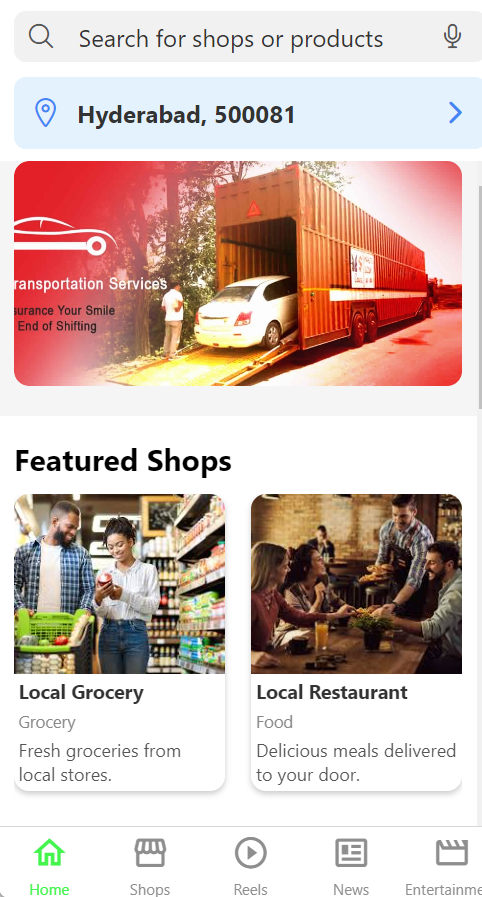
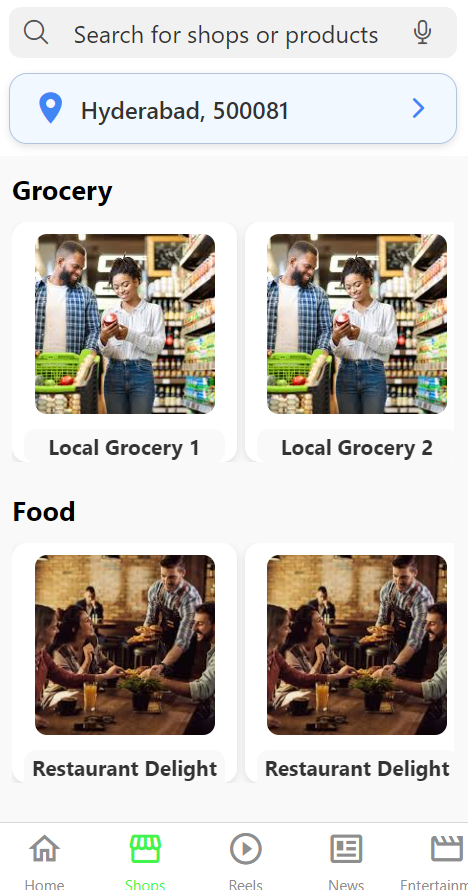

# LocalConnect App

LocalConnect is a B2B and B2C marketplace designed to integrate e-commerce, social media, and hyper-local recommendations. It connects end-users with local sellers and integrates local transportation options to enhance the shopping experience.

## Features

- **E-Commerce Integration:** Browse and purchase products from local shops within your city.
- **Social Media Fusion:** Local businesses can showcase their products through posts and updates.
- **Hyper-Local Recommendations:** Tailored product suggestions based on your location and preferences.
- **Local Transportation:** Connects users with local buses and auto-rickshaws for delivery and transportation.

## Screenshots

<div>
    
    
    
</div>

## Getting Started

To get started with LocalConnect, follow these steps:

1. **Clone the Repository:**
   ```bash
   git clone https://github.com/Pranay9392/local-connect.git
